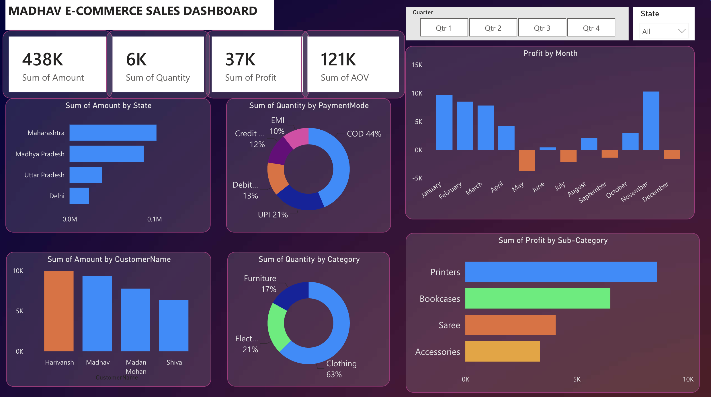
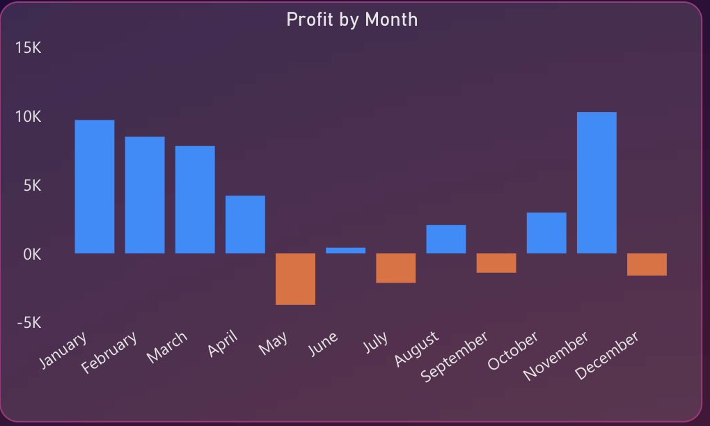
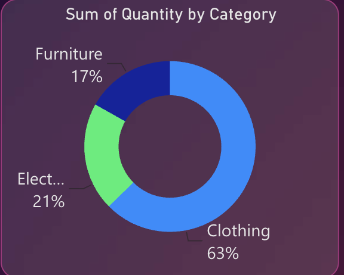

# 📊 Madhav E-Commerce Sales Dashboard | Power BI

An interactive **Power BI dashboard** built to analyze e-commerce sales performance using real business KPIs and interactive visualizations. This project provides valuable insights into sales, profit, customer behavior, product categories, and payment methods, enabling data-driven business decisions.

---

## 📌 Project Overview

This project demonstrates how Power BI can transform raw sales data into an interactive business dashboard.

The dashboard enables users to:

- Monitor overall business performance
- Analyze sales and profit trends
- Identify top-performing states and customers
- Understand customer payment preferences
- Evaluate category and sub-category performance
- Make informed business decisions through interactive filtering

---

## 🛠️ Tech Stack

- Microsoft Power BI
- Power Query
- DAX
- Data Modeling
- CSV Dataset

---

## 📂 Dataset

The dashboard is built using two datasets:

- **Orders.csv** – Customer orders, state, order details, etc.
- **Details.csv** – Sales amount, quantity, profit, category, payment mode and transaction details.

---

# 📈 Dashboard KPIs

| KPI | Value |
|------|-------:|
| 💰 Total Sales Amount | **438K** |
| 📦 Total Quantity Sold | **6K** |
| 📈 Total Profit | **37K** |
| 🛒 Average Order Value (AOV) | **121K** |

---

# 📊 Dashboard Features

✅ Interactive Quarter Filter

✅ State-wise Sales Analysis

✅ Customer-wise Sales Analysis

✅ Monthly Profit Trend

✅ Category-wise Quantity Distribution

✅ Payment Mode Analysis

✅ Sub-Category Profit Analysis

✅ KPI Cards for Sales, Quantity, Profit & AOV

---

# 📈 Key Business Insights

### 🏆 Overall Performance

- Generated **438K** in total sales.
- Sold over **6K** products.
- Achieved an overall profit of **37K**.
- Average Order Value (AOV) reached **121K**.

---

### 📍 State-wise Sales

- Maharashtra generated the highest sales.
- Madhya Pradesh ranked second.
- Uttar Pradesh and Delhi contributed comparatively lower sales.

---

### 💳 Payment Mode Analysis

- **Cash on Delivery (COD)** accounted for **44%** of total orders.
- **UPI** contributed **21%**.
- Debit Card (**13%**), Credit Card (**12%**) and EMI (**10%**) were the remaining payment methods.

---

### 👕 Category Analysis

- Clothing dominated sales quantity with **63%**.
- Electronics contributed **21%**.
- Furniture accounted for **17%**.

---

### 📈 Monthly Profit Trend

- Highest profits were recorded in **January** and **November**.
- Profit declined significantly during **May**.
- Several months showed fluctuating profitability, indicating seasonal business trends.

---

### 👤 Customer Insights

- Harivansh generated the highest sales.
- Madhav ranked second among top customers.
- Madan Mohan and Shiva also contributed significantly to revenue.

---

### 📦 Sub-Category Performance

- **Printers** generated the highest profit.
- **Bookcases** ranked second.
- Sarees and Accessories contributed comparatively lower profits.

---

# 💡 Business Recommendations

- Increase inventory for high-demand Clothing products.
- Focus marketing campaigns in Maharashtra and Madhya Pradesh.
- Encourage digital payment methods through cashback offers.
- Investigate reasons behind losses during low-performing months.
- Prioritize high-profit sub-categories such as Printers and Bookcases.

---

# 📷 Dashboard Preview

## 📌 Complete Dashboard



---

## 📌 Monthly Profit Trend



---

## 📌 Category-wise Quantity Distribution



---

## 📁 Repository Structure

```text
Madhav-Sales-Dashboard-PowerBI/
│
├── Madhav Sales Dashboard.pbix
├── Dataset/
│   ├── Orders.csv
│   └── Details.csv
├── images/
│   ├── dashboard_overview.png
│   ├── profit_by_month.png
│   └── category_analysis.png
├── README.md
├── LICENSE
└── .gitignore
```

---

## 👨‍💻 Author

**Baldev Singh**

- GitHub: https://github.com/baldev-sin
- LinkedIn: https://www.linkedin.com/in/baldev-sin/

---

⭐ If you found this project helpful, consider giving it a **Star**!
